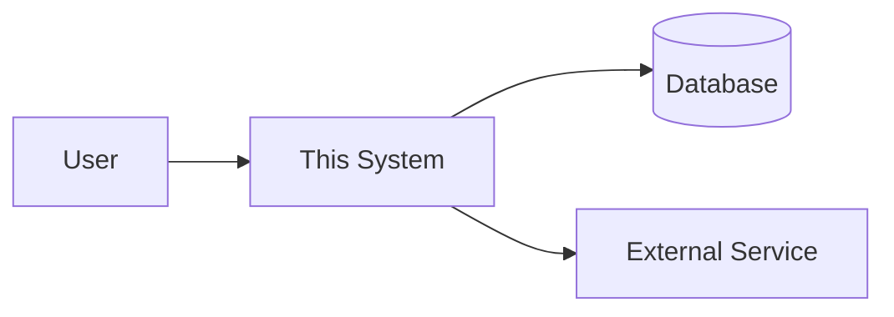
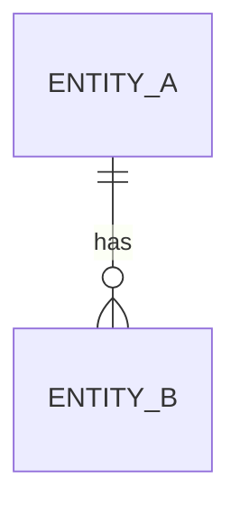

# ARCHITECTURE.md

> Explain **why**, not just what. A new engineer should be able to rebuild the system from this document without asking the original developer.

**Status:** Draft
**Last updated:** _YYYY-MM-DD_

---

## 1. System Context

_What is inside the system, what is outside, and what crosses the boundary._

## 2. High-Level Architecture

_Style (monolith / modular monolith / microservices / client-server / desktop) and **why that one**._

| Decision | Chosen | Rejected alternatives | Why |
|---|---|---|---|
| Architecture style | | | |
| Language | | | |
| Framework | | | |
| Database | | | |
| Hosting | | | |

## 3. Components

| Component | Responsibility | Depends on |
|---|---|---|
| | | |

## 4. Data Flow

_Trace one complete request end to end: entry point → validation → business logic → persistence → response._

1.
2.
3.

## 5. Data Model

| Table | Purpose | Key relationships |
|---|---|---|
| | | |

## 6. Authentication & Authorization

- **Auth method:**
- **Session/token handling:**
- **Roles and permissions:**

## 7. External Services

| Service | Used for | Failure behavior |
|---|---|---|
| | | |

## 8. Error Handling Strategy

_How errors surface, get logged, and get shown to users. What is never exposed to the user._

## 9. Performance Considerations

| Area | Expected load | Strategy |
|---|---|---|
| | | |

## 10. Security Considerations

- Input validation:
- Secrets management:
- Data at rest / in transit:
- Known risks accepted:

## 11. Deployment

- **Environments:** dev / staging / production
- **Pipeline:**
- **Rollback procedure:**

## 12. Architecture Decision Records

| # | Date | Decision | Why | Consequences |
|---|---|---|---|---|
| 1 | | | | |
