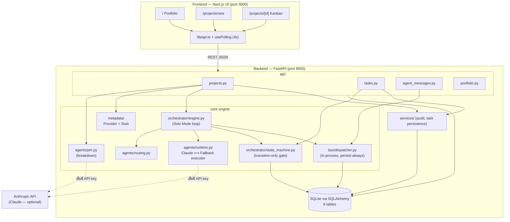
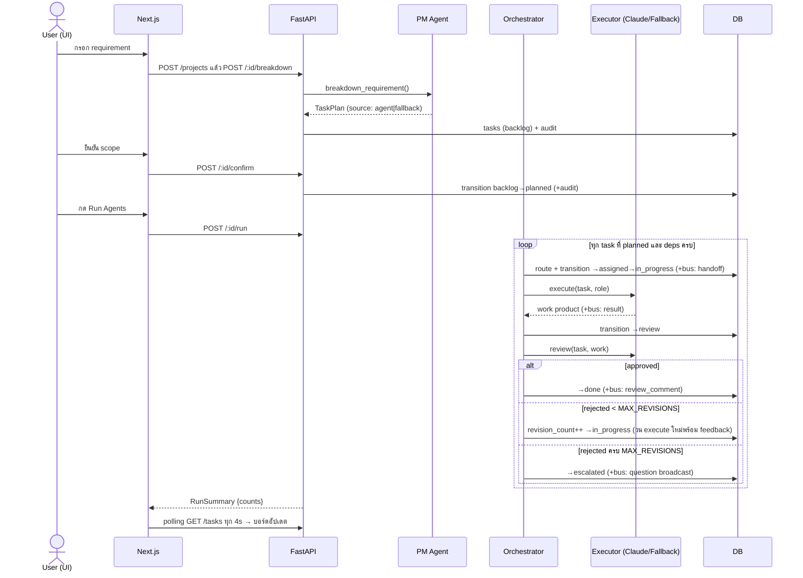
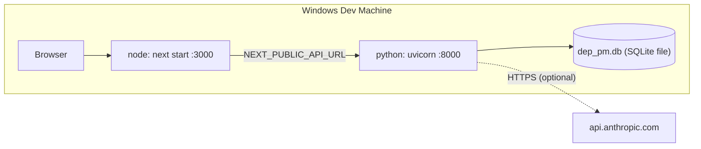
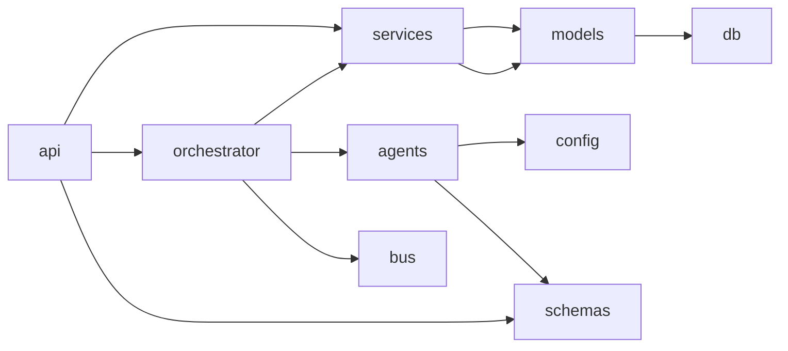

# ARCHITECTURE.md — DEP-PM Platform

> เอกสารสถาปัตยกรรม (MASTER PROMPT §1-4) | อัปเดต: 2026-07-06 (หลัง Sprint 3)
> คู่กับ: `SYSTEM_DOCUMENTATION.md` (โค้ด/โมดูล), `API.md`, `DATABASE.md`, `SECURITY.md`, `AI_AGENT_GUIDE.md`

---

## 1. Project Overview

### Purpose
DEP-PM คือแพลตฟอร์มบริหารโปรเจกต์แบบ AI-Native ที่ให้ **มนุษย์และ AI Agent ทำงานบนบอร์ดเดียวกัน**:
รับ requirement → AI แตกงาน → มอบหมาย Agent/คน → ติดตามบน Kanban → (Sprint 4) Deploy อัตโนมัติเมื่อผ่าน review

### Business Goal
ลดเวลา Requirement → First Deploy ลง 50% เทียบ workflow เดิมของทีม dPRO (KPI ใน `DEVELOPMENT_PLAN.md` §8)
โดยให้ AI ทำงาน routine (แตกงาน, implement, review รอบแรก) และคนตัดสินใจเฉพาะจุดที่ escalate

### Problems Solved
| ปัญหาเดิม | วิธีแก้ในระบบ |
|-----------|---------------|
| แตกงานจาก requirement ใช้เวลา PM มาก | PM Agent (Claude) แตกเป็น Task Plan JSON อัตโนมัติ |
| งานที่มอบให้ AI ไม่มี audit trail | ทุก state change ลง `audit_log`, ทุกข้อความ agent ลง `agent_messages` |
| Dashboard มี blind spot ระหว่างงานคน/AI | ทุก task (คนหรือ agent) ไหลผ่าน State Machine เดียวกัน |
| งาน AI คุณภาพไม่แน่นอน | Reviewer persona ตรวจทุกงาน + Escalation Rule (fail 2 → คนรับช่วง) |

### Target Users
ทีมพัฒนา dPRO (โปรเจกต์ dPRO AI Parking, MChat, Farm Lab) — MVP เป็น single-user (Vinit)

### System Scope (MVP, 4 sprints)
- ✅ Sprint 1: Intake (New/Existing-stub), PM Agent breakdown
- ✅ Sprint 2: State Machine, Solo Mode Orchestrator, Message Bus
- ✅ Sprint 3: Kanban Dashboard, Message Log, Portfolio
- ⬜ Sprint 4: Deploy pipeline, PostgreSQL/Redis, Team Mode

### Non-Goals (Out of Scope MVP)
Billing/Invoicing, Agent marketplace, Mobile native app, Knowledge Graph จริง (รอ DEP v3.0 Phase 2+),
Authentication/RBAC (single-user ก่อน), Realtime WebSocket (ใช้ polling)

### Assumptions
1. DEP v3.0 Metadata Engine **ยังไม่มีโค้ดจริง** — Brownfield scan เป็น mock ตลอด MVP (ADR-02)
2. ผู้ใช้คนเดียว รันบนเครื่อง dev Windows — ไม่ต้องมี Docker/PostgreSQL ก่อน Sprint 4
3. Claude API key เดียวพอสำหรับ Solo Mode (ทุก persona ใช้ key เดียว ต่างกันที่ system prompt)

### Project Constraints
- ห้ามแก้ไฟล์ HTML อ้างอิง 3 ไฟล์ (read-only spec)
- Schema ต้อง portable ระหว่าง SQLite ↔ PostgreSQL (ADR-01) — ห้าม dialect-specific SQL
- ไม่เพิ่ม infrastructure ก่อนจำเป็น (Redis/PostgreSQL เลื่อนไป Sprint 4)

### Design Philosophy & Development Principles
1. **Auditable by default** — ทุกอย่างที่ agent ทำต้องตรวจย้อนหลังได้ (audit_log + agent_messages เป็น source of truth)
2. **Interface ก่อน implementation** — ส่วนที่ยังไม่พร้อม (Metadata Engine, Team Mode providers) ล็อกเป็น interface + stub เพื่อเสียบของจริงภายหลังโดยไม่แก้ผู้เรียก
3. **Graceful degradation** — ไม่มี API key ระบบยังเดินครบวงจร (fallback path) และบอกผู้ใช้ชัดว่าเป็น fallback
4. **Upgrade path ชัดทุก ADR** — เริ่มเบา (SQLite, in-process bus, polling) แต่ทุกตัวมีเส้นทางขึ้นสเปกเต็มเขียนไว้ล่วงหน้า

---

## 2. High-Level Architecture

### Architecture Pattern: **Layered Monolith + Pluggable Engine Interfaces**

Backend เป็น monolith ชั้นเดียว (FastAPI) แบ่ง layer ชัด: `api → services/orchestrator → models/db`
โดยจุดที่คาดว่าจะเปลี่ยน (agent provider, metadata engine, message transport) เป็น interface/Protocol

**ทำไมเลือก pattern นี้**
- ทีมเล็ก (1 คน + AI) — microservices เพิ่ม operational cost โดยไม่ได้อะไร
- Solo Mode รันใน process เดียว — ไม่มี cross-process communication ที่แท้จริง
- MVP ต้อง iterate เร็ว — layered monolith debug ง่ายสุด

**ทางเลือกที่พิจารณาแล้วไม่เลือก**

| ทางเลือก | เหตุผลที่ไม่เลือกตอนนี้ |
|----------|------------------------|
| Microservices (agent service แยก) | ทีมเล็ก, ไม่มี scale requirement, เพิ่ม latency/complexity |
| Event-sourced (ทุกอย่างเป็น event) | audit_log + agent_messages ให้ auditability พอแล้วโดยไม่ต้อง rebuild-from-events |
| Celery/task queue ตั้งแต่แรก | `/run` synchronous พอสำหรับ single-user; queue เพิ่มเมื่อมี multi-user (Sprint 4+) |

**Tradeoffs ที่ยอมรับ**
- ✅ ง่าย, เร็ว, ทดสอบง่าย (in-memory SQLite ต่อ test)
- ⚠️ `/run` block request จนจบ — โปรเจกต์ใหญ่จะช้า (ยอมรับใน MVP, มีแผน background job)
- ⚠️ Scale แนวนอนไม่ได้จนกว่าจะย้าย bus ไป Redis (ADR-03 upgrade path พร้อมแล้ว)

### Component Diagram



### Sequence Diagram — วงจรหลัก (New Project → Done)



### Deployment Diagram (ปัจจุบัน — dev เครื่องเดียว)



Sprint 4 (แผน): Vercel (FE) + Render/Railway (BE) + PostgreSQL managed + GitHub Actions

### Scalability / Maintainability / Extensibility
- **Scalability:** single-process พอสำหรับ single-user; คอขวดแรกคือ `/run` synchronous → แก้ด้วย background worker + Redis bus (เส้นทางเขียนไว้ใน ADR-03)
- **Maintainability:** กติกากลางบังคับใน code review — status ผ่าน `transition()` เท่านั้น, ข้อความผ่าน `publish()` เท่านั้น (ดู `AI_AGENT_GUIDE.md`)
- **Extensibility:** จุดเสียบ 3 จุดคือ `PersonaExecutor` (Team Mode), `MetadataProvider` (DEP Engine จริง), bus transport (Redis) — ทั้งหมดเปลี่ยน implementation ได้โดยไม่แตะ orchestrator

---

## 3. Tech Stack (WHY ต่อรายการ)

### Backend

| เทคโนโลยี | ทำไมเลือก | ข้อดี | ข้อเสีย/ความเสี่ยง | ทางเลือกที่ไม่เลือก |
|-----------|-----------|-------|--------------------|---------------------|
| **Python 3.12** | ทีมถนัด + ecosystem AI ดีสุด (anthropic SDK) | ไลบรารีครบ, พัฒนาเร็ว | ช้ากว่า Go/Rust (ไม่ใช่คอขวดของงานนี้ — คอขวดคือ LLM latency) | Node.js (แยก ecosystem จาก AI tooling), Go (dev ช้ากว่า) |
| **FastAPI 0.115** | OpenAPI อัตโนมัติ (/docs), Pydantic ในตัว, async-ready | validation ฟรี, type-safe | dependency-injection แบบ FastAPI ผูกกับ framework | Flask (ต้องประกอบเอง), Django (หนักเกินสำหรับ API-only) |
| **SQLAlchemy 2.x** | ORM มาตรฐาน Python, dialect abstraction ตรงกับ ADR-01 | ย้าย SQLite→PostgreSQL ไม่แก้ query | learning curve ของ 2.x style | raw SQL (ผิด ADR-01), Tortoise (ecosystem เล็ก) |
| **Alembic 1.14** | คู่กับ SQLAlchemy, autogenerate | migration history ชัด | autogenerate ต้องตรวจมือเสมอ (เคยขาด import `GUID`) | ไม่มี migration tool (ยอมรับไม่ได้เมื่อมี prod DB) |
| **SQLite (dev)** | เริ่มได้ทันที ไม่ติดตั้งอะไร (ADR-01) | zero-config, in-memory ใน test | JSON query จำกัด, concurrency ต่ำ | PostgreSQL ตั้งแต่แรก (บังคับติดตั้ง Docker ก่อนเวลา) |
| **anthropic SDK 0.42** | official SDK, retry ในตัว | typed responses | model id ต้อง config ผ่าน env (รุ่นเปลี่ยนเร็ว) | raw HTTP (เสีย retry/typing ฟรี ๆ) |
| **pytest 8** | มาตรฐาน, fixture model เหมาะกับ DB-per-test | TestClient integration ง่าย | — | unittest (verbose กว่า) |

### Frontend

| เทคโนโลยี | ทำไมเลือก | ข้อดี | ข้อเสีย/ความเสี่ยง | ทางเลือกที่ไม่เลือก |
|-----------|-----------|-------|--------------------|---------------------|
| **Next.js 16.2 (App Router)** | แผนระบุ Next 15; create-next-app@latest ให้ 16 — รับเวอร์ชันใหม่กว่า | SSR/SSG พร้อม, Vercel deploy ตรง (Sprint 4) | breaking changes จาก training data ของ AI agents (`params` เป็น Promise — ดู `frontend/AGENTS.md`) | Vite+React (ต้องประกอบ routing เอง), SvelteKit (ทีมไม่ถนัด) |
| **TypeScript** | types mirror backend schema จับ contract drift ตอน compile | build = typecheck | ต้อง sync types มือ (ไม่มี codegen) | JS ล้วน (เสีย safety), openapi-codegen (เพิ่ม toolchain — พิจารณาภายหลัง) |
| **Tailwind CSS 4** | มากับ scaffold, utility-first เร็ว | ไม่มี CSS file แยกให้ diverge | class ยาว | shadcn/ui ฯลฯ (**ตัดสินใจไม่ใช้** — ลด dependency ตามหลัก CLAUDE.md) |
| **Polling (ไม่ใช่ WebSocket)** | ADR-04 — ผู้ใช้คนเดียว ไม่คุ้ม infra | ง่าย, stateless | latency สูงสุด 4s | SSE/WebSocket (upgrade path เขียนไว้; รอ Redis pub/sub) |

### Cross-cutting
- **Authentication: ยังไม่มี** (single-user MVP — ดู `SECURITY.md` สำหรับ posture และแผน)
- **CI/CD: ยังไม่มี** (Sprint 4: GitHub Actions)
- **Logging/Monitoring: ยังไม่มี** นอกจาก uvicorn access log + audit_log ใน DB (แผนใน `SYSTEM_DOCUMENTATION.md` §20)

---

## 4. Folder Structure (ทุกโฟลเดอร์ + เหตุผลที่มี + ทิศทาง dependency)

```
d_DEP-PM Platform/
├── CLAUDE.md                  ← คู่มือ AI session (อ่านก่อนทุกงาน) — index ของทุกกติกา
├── PROJECT_STATUS.md          ← สถานะล่าสุด + next tasks (session continuity)
├── CHANGELOG.md               ← ประวัติ per-sprint
├── *.html (3 ไฟล์)            ← สเปกต้นทาง READ-ONLY (Blueprint, DEP v3.0, AI Dev Team)
├── docs/
│   ├── DEVELOPMENT_PLAN.md    ← แผน 4 สปรินต์ + ADR-01..04 (อนุมัติแล้ว — แก้เมื่อ ADR เปลี่ยน)
│   ├── ARCHITECTURE.md        ← ไฟล์นี้
│   ├── SYSTEM_DOCUMENTATION.md, API.md, DATABASE.md, SECURITY.md, AI_AGENT_GUIDE.md
│
├── backend/
│   ├── app/
│   │   ├── main.py            ← FastAPI app + CORS + router wiring (จุด entry เดียว)
│   │   ├── config.py          ← Settings (pydantic-settings, env/.env) — cached singleton
│   │   ├── constants.py       ← Enums กลางทุกตัว (TaskStatus, AgentRole, …) + MAX_REVISIONS
│   │   │                         เหตุผล: DB เก็บ string เปล่า (portable) แต่โค้ด validate ผ่าน Enum
│   │   ├── db/                ← ชั้น persistence infrastructure (ไม่มี business logic)
│   │   │   ├── types.py       ← GUID + JSON type decorators (หัวใจ ADR-01)
│   │   │   ├── base.py        ← DeclarativeBase + TimestampMixin
│   │   │   └── session.py     ← engine, SessionLocal, get_db dependency
│   │   ├── models/            ← ORM 6 ตาราง (1 ไฟล์/ตาราง) — ดู DATABASE.md
│   │   ├── schemas/           ← Pydantic request/response (สัญญากับ frontend)
│   │   ├── api/               ← Routers บาง ๆ — แปลง HTTP ↔ service calls เท่านั้น
│   │   ├── orchestrator/      ← State Machine + engine (สมองของระบบ)
│   │   ├── agents/            ← personas, routing, runtime, pm breakdown
│   │   ├── bus/               ← in-process dispatcher (ADR-03)
│   │   ├── metadata/          ← MetadataProvider interface + Stub (ADR-02)
│   │   └── services/          ← ชั้นกลาง: audit, task-plan persistence
│   ├── alembic/               ← migrations (a14314b6f9a2 schema, b2f1c0d3e4a5 seed)
│   ├── tests/                 ← pytest 34 เคส (in-memory SQLite ต่อ test)
│   ├── requirements.txt, .env.example, pytest.ini, alembic.ini, README.md
│
└── frontend/
    ├── src/lib/               ← types.ts (mirror backend!), api.ts, usePolling.ts
    ├── src/app/               ← App Router: / , /projects/new , /projects/[id]
    ├── AGENTS.md              ← คำเตือน Next 16 breaking changes สำหรับ AI agents
    └── .env.local.example     ← NEXT_PUBLIC_API_URL
```

### Dependency Direction (บังคับ — ห้ามย้อนศร)



- `db/` และ `constants.py` เป็นชั้นล่างสุด — import ได้จากทุกที่, ห้าม import ขึ้นบน
- `models/` ห้ามรู้จัก `schemas/` (ORM ไม่ผูก API shape)
- `orchestrator/` ห้ามรู้จัก `api/` (engine ถูกเรียกจาก router ไม่ใช่กลับกัน)
- `agents/runtime.py` ห้าม import `orchestrator/` (ป้องกัน circular — orchestrator เรียก runtime ผ่าน Protocol)

### Ownership / Lifecycle
- ไฟล์ *.html: เจ้าของคือผู้ใช้ (Vinit) — ระบบห้ามแก้
- `docs/DEVELOPMENT_PLAN.md`: แก้เมื่อ ADR เปลี่ยนเท่านั้น (พร้อม approve)
- เอกสารชุดนี้ (`docs/*.md`): อัปเดตท้ายทุก sprint พร้อม CHANGELOG
- `frontend/src/lib/types.ts`: **ผูกกับ backend schema** — แก้ backend ต้องแก้ที่นี่ในคอมมิตเดียวกัน
