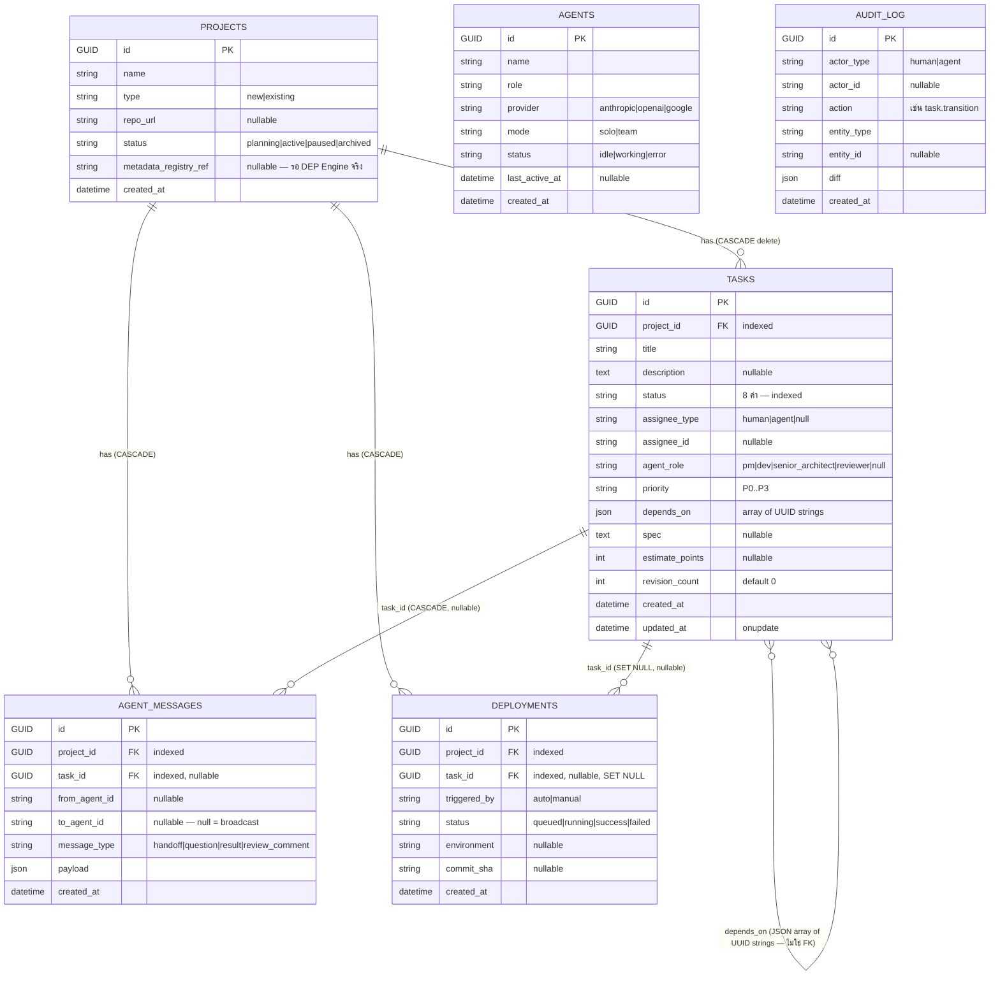

# DATABASE.md — DEP-PM Platform

> Data Model + Database Documentation (MASTER PROMPT §10-11) | อัปเดต: 2026-07-06 (หลัง Sprint 3)
> Schema source of truth: `backend/app/models/` + `backend/alembic/versions/`

---

## 10. Data Model

### ER Diagram

### การตัดสินใจเชิงโครงสร้าง (WHY)

| การตัดสินใจ | เหตุผล | Tradeoff |
|-------------|--------|----------|
| PK เป็น UUID (custom `GUID` type) | merge ข้าม environment ได้, ไม่ leak ลำดับ, PostgreSQL ใช้ native UUID | ใหญ่กว่า int, ต้องมี type decorator (ADR-01) |
| `depends_on` เป็น JSON array **ไม่ใช่ join table** | ADR-01 ห้าม PG array; join table over-engineered สำหรับ dependency ตื้น ๆ | ❌ ไม่มี referential integrity — id ที่ลบแล้วอาจค้างใน array (orchestrator ป้องกันโดยเช็คว่า resolve ครบ) ❌ query "ใคร depend on X" ต้อง scan |
| status เก็บ string เปล่า ไม่ใช่ DB enum | portable SQLite↔PG; เพิ่มค่าไม่ต้อง migrate | typo ป้องกันที่ชั้นแอป (Enum ใน `constants.py`) ไม่ใช่ DB |
| `audit_log` ไม่มี FK ไปตารางอื่น | append-only log ต้องรอดแม้ entity ถูกลบ | join ต้องทำผ่าน entity_id string |
| `agent_messages.to_agent_id = NULL` หมายถึง broadcast | รองรับข้อความ escalation ถึง "ผู้ใช้/dashboard" โดยไม่ต้องมี user table | ต้อง document ความหมาย (ที่นี่) |
| `revision_count` denormalized บน tasks | Escalation Rule เช็คเร็ว ไม่ต้องนับ review_comment | ต้อง increment ใน engine เท่านั้น (ห้ามที่อื่นแตะ) |

### Normalization
อยู่ที่ ~3NF ยกเว้น 2 จุด denormalize โดยเจตนา: `depends_on` (JSON) และ `revision_count` (counter)

### Transactions & Concurrency
- **Convention กลาง:** `transition()` และ `publish()` **ไม่ commit** — ผู้เรียก (router หรือ engine) เป็นเจ้าของ transaction
- Router: commit ต่อ request | Engine: commit ต่อ task (งานเสร็จแล้วไม่ rollback ถ้า task ถัดไปพัง)
- SQLite = writer เดียว (พอสำหรับ single-user MVP); ประเด็น concurrency จริงจะเกิดเมื่อมี background worker → เป็นเหตุผลหนึ่งที่ Sprint 4 ย้าย PostgreSQL

---

## 11. Database Documentation (ต่อตาราง)

### `projects`
| Column | Type | Constraint | หมายเหตุ |
|--------|------|-----------|----------|
| id | GUID | PK | |
| name | VARCHAR(200) | NOT NULL | |
| type | VARCHAR(20) | NOT NULL, default 'new' | `existing` ต้องมี repo_url (validate ที่ schema) |
| repo_url | VARCHAR(500) | NULL | |
| status | VARCHAR(20) | NOT NULL, default 'planning' | ยังไม่มี logic เปลี่ยน status โปรเจกต์ (หลัง MVP) |
| metadata_registry_ref | VARCHAR(500) | NULL | จองไว้สำหรับ DEP Engine จริง (ADR-02) |
| created_at | DATETIME(tz) | NOT NULL, server_default now | |

Query pattern: `GET /portfolio` อ่านทุกแถว (โปรเจกต์น้อย — ไม่ต้อง index เพิ่ม)

### `tasks` — ตารางร้อนสุด
| Column | Type | Constraint |
|--------|------|-----------|
| id | GUID | PK |
| project_id | GUID | FK→projects CASCADE, **INDEX** |
| title | VARCHAR(300) | NOT NULL |
| description | TEXT | NULL |
| status | VARCHAR(20) | NOT NULL default 'backlog', **INDEX** |
| assignee_type / assignee_id / agent_role | VARCHAR | NULL |
| priority | VARCHAR(4) | NOT NULL default 'P2' |
| depends_on | JSON | NOT NULL default [] |
| spec | TEXT | NULL |
| estimate_points | INT | NULL |
| revision_count | INT | NOT NULL default 0 |
| created_at / updated_at | DATETIME(tz) | updated_at มี onupdate (Python-side) |

**Indexes:** `ix_tasks_project_id` (ทุก query กรองโปรเจกต์), `ix_tasks_status` (orchestrator หา planned, portfolio group by)
**Query patterns หลัก:** list ต่อโปรเจกต์ (limit/offset), `_next_runnable` (WHERE project+status=planned ORDER BY created_at), portfolio GROUP BY (project_id, status)
**Performance note:** `list_tasks` นับ total ด้วยการ `.all()` แล้ว `len()` — ควรเปลี่ยนเป็น `COUNT(*)` เมื่อ task เยอะ (บันทึกใน SYSTEM_DOCUMENTATION §22)

### `agents`
Seed 1 แถวจาก migration: `Claude Solo` (id `…0001`, role pm, mode solo, provider anthropic)
`status` (idle/working/error) ยังไม่ถูกอัปเดตโดย engine — จองไว้สำหรับ background runtime (Sprint 4)

### `agent_messages` — source of truth ของ Message Bus (ADR-03)
**Indexes:** project_id, task_id | **เขียนโดย:** `bus.publish()` เท่านั้น
payload shape ตาม message_type:
- `handoff`: `{title, spec}` — orchestrator → persona
- `result`: `{work, revision}` — persona → reviewer
- `review_comment`: `{approved, comment}` — reviewer → persona
- `question`: `{escalated, reason, last_comment}` — broadcast (to=NULL) เมื่อ escalate

### `deployments`
โครงพร้อมตั้งแต่ Sprint 1 แต่**ยังไม่มี writer** — Sprint 4 (deploy pipeline) จะเป็นผู้เขียน
`task_id` เป็น SET NULL (ลบ task ไม่ควรลบประวัติ deploy)

### `audit_log` — append-only
เขียนผ่าน `services/audit.record_audit()` เท่านั้น | actions ปัจจุบัน:
`project.created`, `task.created`, `task.updated`, `task.transition`, `task.routed`, `task_plan.created`
`diff` เป็น JSON เช่น `{"status": {"from": "review", "to": "done"}, "reason": "review approved"}`
**ไม่มี index เพิ่ม** — ยังไม่มี query pattern จริง (จะเพิ่มเมื่อทำ audit viewer)

---

## Migration History

| Revision | เนื้อหา | หมายเหตุ |
|----------|---------|----------|
| `a14314b6f9a2` | สร้าง 6 ตาราง + indexes | autogenerate แล้ว**แก้มือ**: เพิ่ม `import app.db.types` (autogen ไม่ใส่ให้) — บทเรียน: ตรวจ autogen เสมอ |
| `b2f1c0d3e4a5` | seed agent "Claude Solo" | fixed UUID `00000000-…-0001` → deterministic ทุก environment; downgrade ลบเฉพาะแถวนี้ |

### กติกา migration (จาก ADR-01 + CLAUDE.md Database Rules)
1. คอลัมน์ JSON ใช้ SQLAlchemy `JSON` (ห้าม JSONB ตรง ๆ — map ตอน deploy PG)
2. UUID ผ่าน `GUID` decorator เสมอ
3. `render_as_batch=True` ใน env.py (SQLite ALTER ปลอดภัย)
4. ห้าม destructive migration โดยไม่ได้รับคำสั่งชัดเจน
5. รัน: `alembic upgrade head` | ย้อน: `alembic downgrade -1`

### แผนย้าย PostgreSQL (Sprint 4)
1. ตั้ง `DATABASE_URL=postgresql+psycopg://…` 2. `alembic upgrade head` (GUID→native UUID, JSON→JSON/JSONB อัตโนมัติผ่าน dialect) 3. รัน test suite เดิมทั้งชุดบน PG (DoD ของ Sprint 4)
