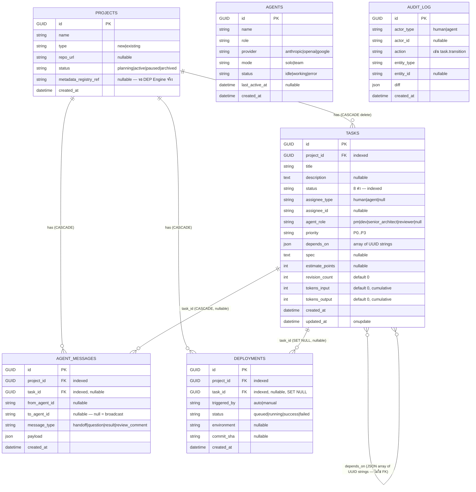

# DATABASE.md — DEP-PM Platform

> Data Model + Database Documentation (MASTER PROMPT §10-11) | อัปเดต: 2026-07-06 (หลัง Sprint 4)
> Schema source of truth: `backend/app/models/` + `backend/alembic/versions/`

---

## 10. Data Model

### ER Diagram

```mermaid
erDiagram
    PROJECTS ||--o{ TASKS : "has (CASCADE delete)"
    PROJECTS ||--o{ AGENT_MESSAGES : "has (CASCADE)"
    PROJECTS ||--o{ DEPLOYMENTS : "has (CASCADE)"
    TASKS ||--o{ AGENT_MESSAGES : "task_id (CASCADE, nullable)"
    TASKS ||--o{ DEPLOYMENTS : "task_id (SET NULL, nullable)"
    TASKS }o--o{ TASKS : "depends_on (JSON array of UUID strings — ไม่ใช่ FK)"

    PROJECTS {
        GUID id PK
        string name
        string type "new|existing"
        string repo_url "nullable"
        string status "planning|active|paused|archived"
        string metadata_registry_ref "nullable — รอ DEP Engine จริง"
        datetime created_at
    }
    TASKS {
        GUID id PK
        GUID project_id FK "indexed"
        string title
        text description "nullable"
        string status "8 ค่า — indexed"
        string assignee_type "human|agent|null"
        string assignee_id "nullable"
        string agent_role "pm|dev|senior_architect|reviewer|null"
        string priority "P0..P3"
        json depends_on "array of UUID strings"
        text spec "nullable"
        int estimate_points "nullable"
        int revision_count "default 0"
        int tokens_input "default 0, cumulative"
        int tokens_output "default 0, cumulative"
        datetime created_at
        datetime updated_at "onupdate"
    }
    AGENTS {
        GUID id PK
        string name
        string role
        string provider "anthropic|openai|google"
        string mode "solo|team"
        string status "idle|working|error"
        datetime last_active_at "nullable"
        datetime created_at
    }
    AGENT_MESSAGES {
        GUID id PK
        GUID project_id FK "indexed"
        GUID task_id FK "indexed, nullable"
        string from_agent_id "nullable"
        string to_agent_id "nullable — null = broadcast"
        string message_type "handoff|question|result|review_comment"
        json payload
        datetime created_at
    }
    DEPLOYMENTS {
        GUID id PK
        GUID project_id FK "indexed"
        GUID task_id FK "indexed, nullable, SET NULL"
        string triggered_by "auto|manual"
        string status "queued|running|success|failed"
        string environment "nullable"
        string commit_sha "nullable"
        datetime created_at
    }
    AUDIT_LOG {
        GUID id PK
        string actor_type "human|agent"
        string actor_id "nullable"
        string action "เช่น task.transition"
        string entity_type
        string entity_id "nullable"
        json diff
        datetime created_at
    }
```

### การตัดสินใจเชิงโครงสร้าง (WHY)

| การตัดสินใจ | เหตุผล | Tradeoff |
|-------------|--------|----------|
| PK เป็น UUID (custom `GUID` type) | merge ข้าม environment ได้, ไม่ leak ลำดับ, PostgreSQL ใช้ native UUID | ใหญ่กว่า int, ต้องมี type decorator (ADR-01) |
| `depends_on` เป็น JSON array **ไม่ใช่ join table** | ADR-01 ห้าม PG array; join table over-engineered สำหรับ dependency ตื้น ๆ | integrity บังคับที่ชั้น API: create validate ทุก id (400 ถ้า dangling), DELETE ปฏิเสธถ้ามีตัวอ้าง (409) — ❌ query "ใคร depend on X" ต้อง scan |
| status เก็บ string เปล่า ไม่ใช่ DB enum | portable SQLite↔PG; เพิ่มค่าไม่ต้อง migrate | typo ป้องกันที่ชั้นแอป (Enum ใน `constants.py`) ไม่ใช่ DB |
| `audit_log` ไม่มี FK ไปตารางอื่น | append-only log ต้องรอดแม้ entity ถูกลบ | join ต้องทำผ่าน entity_id string |
| `agent_messages.to_agent_id = NULL` หมายถึง broadcast | รองรับข้อความ escalation ถึง "ผู้ใช้/dashboard" โดยไม่ต้องมี user table | ต้อง document ความหมาย (ที่นี่) |
| `revision_count` denormalized บน tasks | Escalation Rule เช็คเร็ว ไม่ต้องนับ review_comment | ต้อง increment ใน engine เท่านั้น (ห้ามที่อื่นแตะ) |

### Normalization
อยู่ที่ ~3NF ยกเว้น 2 จุด denormalize โดยเจตนา: `depends_on` (JSON) และ `revision_count` (counter)

### Transactions & Concurrency
- **Convention กลาง:** `transition()` และ `publish()` **ไม่ commit** — ผู้เรียก (router หรือ engine) เป็นเจ้าของ transaction
- Router: commit ต่อ request | Engine: commit ต่อ task (งานเสร็จแล้วไม่ rollback ถ้า task ถัดไปพัง)
- SQLite = writer เดียว (พอสำหรับ single-user MVP); ประเด็น concurrency จริงจะเกิดเมื่อมี background worker → เป็นเหตุผลหนึ่งที่ Sprint 4 ย้าย PostgreSQL

---

## 11. Database Documentation (ต่อตาราง)

### `projects`
| Column | Type | Constraint | หมายเหตุ |
|--------|------|-----------|----------|
| id | GUID | PK | |
| name | VARCHAR(200) | NOT NULL | |
| type | VARCHAR(20) | NOT NULL, default 'new' | `existing` ต้องมี repo_url (validate ที่ schema) |
| repo_url | VARCHAR(500) | NULL | |
| status | VARCHAR(20) | NOT NULL, default 'planning' | ยังไม่มี logic เปลี่ยน status โปรเจกต์ (หลัง MVP) |
| metadata_registry_ref | VARCHAR(500) | NULL | จองไว้สำหรับ DEP Engine จริง (ADR-02) |
| ceo_task_id | VARCHAR(36) | NULL, **UNIQUE** | task ใน d_CEO ที่ถูก delegate ลงมา (Phase 1) — NULL = โปรเจกต์ที่สร้างเองในระบบ |
| local_path | VARCHAR(500) | NULL | โฟลเดอร์จริงบนดิสก์ (ตั้งตอน `/bootstrap` — ADR-05) · **เป็นรั้วของทุกการเขียนไฟล์**: ไฟล์ดีไซน์เข้า `_design_input/` และผลงานของ task เขียนได้เฉพาะใต้นี้ · NULL = ไม่มีโฟลเดอร์ผูกไว้ (งานจากเลขา/โปรเจกต์เดิม) |
| kind | VARCHAR(20) | NOT NULL, server_default 'code' | ชนิดงาน `code`/`doc`/`idea` — ตัดสินว่าเส้นทาง 6 ขั้นเปิดขั้นไหนบ้าง |
| created_at | DATETIME(tz) | NOT NULL, server_default now | |

Query pattern: `GET /portfolio` อ่านทุกแถว (โปรเจกต์น้อย — ไม่ต้อง index เพิ่ม)

**ทำไมไม่มีคอลัมน์ `stage`:** ขั้นบนเส้นทางงาน (ไอเดีย → โครงสร้าง → แผนงาน → ลงมือ → ส่งขึ้นระบบ
→ การตลาด) **คำนวณสดทุกครั้งที่อ่าน** จาก `local_path` + สถานะ task + deployment ที่มีอยู่จริง
(`services/stages.py`) — สถานะที่ต้องให้คนหรือโค้ดมากดอัปเดตจะไม่ตรงกับความจริงในที่สุด
และเราเคยโดนบทเรียนนี้มาแล้ว (รายงานว่า "เสร็จ" ทั้งที่ไม่มีชิ้นงาน — QC จับได้ 3 ส.ค.)
· ส่วน `kind` เก็บจริงเพราะเป็น**เจตนาของคน** ที่ระบบเดาจากข้อมูลไม่ได้

**ทำไม `ceo_task_id` ต้อง UNIQUE:** บังคับกติกา **"1 task ธุรกิจใน d_CEO = 1 project ที่นี่"**
(ไม่สร้างทะเบียนงานธุรกิจซ้อน — `AGENTS.md` §3.1) และกันการดึงงานเดิมซ้ำ
เก็บเป็น `VARCHAR(36)` ไม่ใช่ `GUID` **โดยตั้งใจ** — id นี้เป็นของระบบอื่น เราไม่ควรตีความ
รูปแบบของเขา แค่เก็บ/เทียบเป็น string (ถ้า d_CEO เปลี่ยนรูปแบบ id เราไม่พัง)
> หมายเหตุ dialect: ทั้ง SQLite และ PostgreSQL อนุญาตหลายแถวเป็น NULL ในคอลัมน์ UNIQUE
> — โปรเจกต์ที่สร้างเองจึงอยู่ร่วมกันได้ตามปกติ

### `tasks` — ตารางร้อนสุด
| Column | Type | Constraint |
|--------|------|-----------|
| id | GUID | PK |
| project_id | GUID | FK→projects CASCADE, **INDEX** |
| title | VARCHAR(300) | NOT NULL |
| description | TEXT | NULL |
| status | VARCHAR(20) | NOT NULL default 'backlog', **INDEX** |
| assignee_type / assignee_id / agent_role | VARCHAR | NULL |
| priority | VARCHAR(4) | NOT NULL default 'P2' |
| depends_on | JSON | NOT NULL default [] |
| spec | TEXT | NULL |
| estimate_points | INT | NULL |
| revision_count | INT | NOT NULL default 0 |
| tokens_input / tokens_output | INT | NOT NULL default 0 — LLM usage สะสมทุก execute/review call ของ task (debt #7) |
| token_usage | JSON (`JSONType`) | NULL ได้ — **โทเคนแยกตามผู้ให้บริการ** `{"anthropic": {"model": …, "input": …, "output": …, "calls": …}}` · 1 task มีได้หลายเจ้าจริง (Team Mode: dev=openai, reviewer=anthropic) · **NULL = งานก่อน 2026-08-14 ที่แยกที่มาไม่ได้** — รายงานนับเป็น `untracked` ไม่ใช่เดาว่าเป็นของ Anthropic |
| created_at / updated_at | DATETIME(tz) | updated_at มี onupdate (Python-side) |

**Indexes:** `ix_tasks_project_id` (ทุก query กรองโปรเจกต์), `ix_tasks_status` (orchestrator หา planned, portfolio group by)
**Query patterns หลัก:** list ต่อโปรเจกต์ (limit/offset), `_next_runnable` (WHERE project+status=planned ORDER BY created_at), portfolio GROUP BY (project_id, status)
**Performance note:** `list_tasks` นับ total ด้วยการ `.all()` แล้ว `len()` — ควรเปลี่ยนเป็น `COUNT(*)` เมื่อ task เยอะ (บันทึกใน SYSTEM_DOCUMENTATION §22)

### `agents`
Seed 1 แถวจาก migration: `Claude Solo` (id `…0001`, role pm, mode solo, provider anthropic)
`status` (idle/working/error) ยังไม่ถูกอัปเดตโดย engine — จองไว้สำหรับ background runtime (Sprint 4)

### `agent_messages` — source of truth ของ Message Bus (ADR-03)
**Indexes:** project_id, task_id | **เขียนโดย:** `bus.publish()` เท่านั้น
payload shape ตาม message_type:
- `handoff`: `{title, spec}` — orchestrator → persona
- `result`: `{work, revision}` — persona → reviewer
- `review_comment`: `{approved, comment}` — reviewer → persona
- `question`: `{escalated, reason, last_comment}` — broadcast (to=NULL) เมื่อ escalate

### `deployments`
Writer: `services/deploy.create_deployment` (ทาง POST /api/deployments หรือ auto-deploy hook)
Status flow: `queued` → `running` (dispatch สำเร็จ) → `success|failed` (CI callback — terminal, ห้ามแก้)
`task_id` เป็น SET NULL (ลบ task ไม่ควรลบประวัติ deploy)

### `audit_log` — append-only
เขียนผ่าน `services/audit.record_audit()` เท่านั้น | actions ปัจจุบัน:
`project.created`, `task.created`, `task.updated`, `task.transition`, `task.routed`, `task_plan.created`
`diff` เป็น JSON เช่น `{"status": {"from": "review", "to": "done"}, "reason": "review approved"}`
**ไม่มี index เพิ่ม** — ยังไม่มี query pattern จริง (จะเพิ่มเมื่อทำ audit viewer)

---

## Migration History

| Revision | เนื้อหา | หมายเหตุ |
|----------|---------|----------|
| `a14314b6f9a2` | สร้าง 6 ตาราง + indexes | autogenerate แล้ว**แก้มือ**: เพิ่ม `import app.db.types` (autogen ไม่ใส่ให้) — บทเรียน: ตรวจ autogen เสมอ |
| `b2f1c0d3e4a5` | seed agent "Claude Solo" | fixed UUID `00000000-…-0001` → deterministic ทุก environment; downgrade ลบเฉพาะแถวนี้ |
| `c7d4e2a9b1f3` | เพิ่ม `tasks.tokens_input/tokens_output` | server_default "0" — แถวเก่าได้ 0 อัตโนมัติ |
| `e5a91c73b204` | เพิ่ม `projects.ceo_task_id` + unique constraint | ใช้ `batch_alter_table` (SQLite ไม่รองรับ ADD CONSTRAINT) · แถวเก่าได้ NULL = ไม่ถือว่ามาจาก d_CEO |
| `a1c8e5f92d47` | เพิ่ม `projects.local_path` | ADR-05 — โฟลเดอร์จริงของโปรเจกต์ · เป็น**รั้ว**ของทุกการเขียนไฟล์ (ไฟล์ดีไซน์ + ผลงานที่เขียนลงไฟล์) · nullable เพราะโปรเจกต์เดิม/งานจากเลขาไม่มีโฟลเดอร์ผูกไว้ |
| `b6e2f4a81c39` | เพิ่ม `projects.kind` | เส้นทาง 6 ขั้น (2026-08-15) · `server_default='code'` ⇒ แถวเดิมทั้งหมดหมายความเหมือนเดิมเป๊ะ ไม่ต้องเดาย้อนหลัง · **ไม่มีคอลัมน์ stage คู่มาด้วยโดยตั้งใจ** (คำนวณสด) |
| `f3a9c1d7e2b8` | เพิ่ม `tasks.token_usage` (JSON) | §5 ใบสั่งงาน 2026-08-06 — โทเคนแยกตามผู้ให้บริการ · **nullable โดยตั้งใจ**: แถวเก่าแยกที่มาไม่ได้จริง ปล่อย NULL แล้วรายงานเป็น `untracked` · เขียนมือพร้อม `import app.db.types` (บทเรียนของ `a14314b6f9a2`) · apply กับ DB จริงแล้ว 2026-08-14 (57 tasks ครบ) |

### กติกา migration (จาก ADR-01 + CLAUDE.md Database Rules)
1. คอลัมน์ JSON ใช้ SQLAlchemy `JSON` (ห้าม JSONB ตรง ๆ — map ตอน deploy PG)
2. UUID ผ่าน `GUID` decorator เสมอ
3. `render_as_batch=True` ใน env.py (SQLite ALTER ปลอดภัย)
4. ห้าม destructive migration โดยไม่ได้รับคำสั่งชัดเจน
5. รัน: `alembic upgrade head` | ย้อน: `alembic downgrade -1`

### แผนย้าย PostgreSQL (Sprint 4)
1. ตั้ง `DATABASE_URL=postgresql+psycopg://…` 2. `alembic upgrade head` (GUID→native UUID, JSON→JSON/JSONB อัตโนมัติผ่าน dialect) 3. รัน test suite เดิมทั้งชุดบน PG (DoD ของ Sprint 4)
