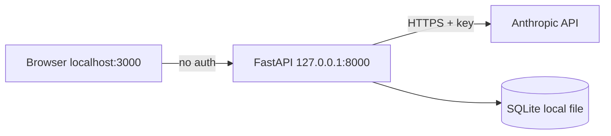

# SECURITY.md — DEP-PM Platform

> Security Documentation (MASTER PROMPT §15) | อัปเดต: 2026-07-06 (หลัง Sprint 3)
> **สถานะตรงไปตรงมา: MVP นี้เป็น single-user บนเครื่อง dev — ยังไม่มี authentication**
> เอกสารนี้บอกทั้ง "มีอะไรแล้ว" และ "จงใจยังไม่มีอะไร + เมื่อไหร่ต้องมี"

---

## Threat Model

### Assets
1. **API keys** (Anthropic; Sprint 4 เพิ่ม OpenAI/Gemini) — asset สำคัญสุด
2. เนื้อหา requirement/spec ของโปรเจกต์ (อาจมีข้อมูลธุรกิจ dPRO)
3. ความถูกต้องของ audit trail (ถูกแก้ = เสียคุณค่าทั้งระบบ)
4. (Sprint 4) GitHub tokens ของ deploy pipeline

### Trust boundaries (ปัจจุบัน)

ทุกอย่างอยู่บนเครื่องเดียว, bind localhost — **attack surface ภายนอกเป็นศูนย์ตราบใดที่ไม่ expose port**

### ภัยที่พิจารณาแล้ว
| ภัย | สถานะ MVP | เหตุผล/แผน |
|-----|-----------|------------|
| ใครก็ได้ยิง API | ⚠️ จริง แต่ยอมรับ — localhost only, single-user | ต้องทำ auth **ก่อน deploy จริง Sprint 4** (บล็อก deploy ถ้ายังไม่มี) |
| API key รั่ว | ✅ ป้องกัน: key อยู่ใน `.env` (gitignored), `.env.example` เป็น placeholder, ไม่เคย log | กติกาใน CLAUDE.md Security Rules |
| Prompt injection ผ่าน requirement/spec → agent ทำเกินสั่ง | ⚠️ มีจริงแต่ blast radius ต่ำ — agent MVP ไม่มี tool ข้างเคียง แค่คืนข้อความ; ผลถูกรีวิว+audit | จะวิกฤตเมื่อ agent มี tools (เขียนโค้ด/รัน command) — ต้อง sandbox ตอนนั้น |
| ข้อมูลอ่อนไหวหลุดเข้า prompt (PDPA — Risk #6) | ⚠️ ยังไม่มี masking | แผน: field masking ก่อนส่งเข้า prompt/bus; ห้าม secrets ใน task spec (กติกาแล้ว, enforcement ยัง) |
| SQL Injection | ✅ ป้องกันโดยโครงสร้าง — ORM ล้วน, ห้าม raw SQL (ADR-01), id เป็น UUID ผ่าน Pydantic validate |
| XSS | ✅ ต่ำ — React escape default; จุดเดียวที่ render payload คือ MessageBubble ใช้ `JSON.stringify` ใน text node (ไม่มี dangerouslySetInnerHTML ทั้งโปรเจกต์) |
| CSRF | N/A ตอนนี้ (ไม่มี session/cookie) — ต้องคิดพร้อม auth |
| Audit tampering | ⚠️ คนเข้าถึงไฟล์ DB แก้ได้ (โมเดล single-user ยอมรับ) — เมื่อ multi-user: DB permission + พิจารณา hash chain |

---

## สถานะต่อหัวข้อมาตรฐาน

| หัวข้อ | สถานะ | รายละเอียด |
|--------|-------|-----------|
| Authentication | ❌ ยังไม่มี (by design, MVP) | แผน Blueprint §15: RBAC Owner/Contributor/Viewer; agent เป็น Contributor เสมอ (ห้ามเกิน) |
| Authorization | ❌ | มาพร้อม auth |
| Secrets | ✅ | env เท่านั้น; `.env`/`.env.local` gitignored; ตรวจแล้วตอน commit แรกว่าไม่มีหลุด |
| Encryption in transit | ⚠️ dev = http localhost | Prod (Sprint 4): HTTPS ทั้งสองขา (Vercel/Render จัดการ) |
| Encryption at rest | ❌ SQLite ไม่เข้ารหัส | ยอมรับใน dev; PG managed มี encryption at rest |
| Rate limiting | ❌ | เพิ่มพร้อม auth (พิจารณา slowapi) |
| Audit trail | ✅ จุดแข็ง | ทุก state change + ทุกข้อความ agent + ทุก routing decision — เขียนผ่านชั้นเดียว (`record_audit`/`publish`) |
| Input validation | ✅ | Pydantic ทุก endpoint + state machine กัน transition ผิด |
| CORS | ✅ จำกัด origin เดียว | `FRONTEND_ORIGIN` — ไม่ใช่ `*` |
| Logging secrets | ✅ | ไม่มี logger ที่แตะ key; ห้าม log payload ที่อาจมี PII เมื่อเพิ่ม logging (กติกา) |
| PDPA/GDPR | ⚠️ | ยังไม่เก็บ personal data ของบุคคลจริงนอกจากเนื้อหา requirement — masking เป็นงานก่อนใช้กับข้อมูลลูกค้าจริง |

## OWASP Top 10 mapping (ย่อ)
A01 Broken Access Control → ยังไม่มี access control เลย (localhost-only mitigates; งาน Sprint 4)
A02 Crypto Failures → secrets ใน env ✅, at-rest ❌ (dev)
A03 Injection → ORM + Pydantic ✅
A05 Misconfig → CORS จำกัด ✅; debug docs (/docs) เปิดอยู่ — ปิดใน prod
A08 Data Integrity → audit append-only (app-level) ⚠️
A09 Logging Failures → ยังไม่มี security logging ❌ (แผน §20 ของ SYSTEM_DOCUMENTATION)

## Security gate ก่อน production (Sprint 4 checklist)
- [ ] Authentication + RBAC (agent = Contributor เสมอ)
- [ ] HTTPS ทั้งระบบ + ปิด `/docs` ใน prod
- [ ] Rate limiting
- [ ] Field masking ก่อนส่ง prompt (PDPA)
- [ ] Secrets ผ่าน platform secret manager (ไม่ใช่ไฟล์ .env บน server)
- [ ] GitHub token ของ pipeline เป็น fine-grained + สิทธิ์ต่ำสุด
