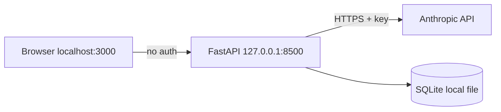

# SECURITY.md — DEP-PM Platform

> Security Documentation (MASTER PROMPT §15) | อัปเดต: 2026-07-06 (หลัง Sprint 4)
> **สถานะตรงไปตรงมา: MVP นี้เป็น single-user บนเครื่อง dev — ยังไม่มี authentication**
> เอกสารนี้บอกทั้ง "มีอะไรแล้ว" และ "จงใจยังไม่มีอะไร + เมื่อไหร่ต้องมี"

---

## Threat Model

### Assets
1. **API keys** (Anthropic · OpenAI · Gemini — ใช้ทั้งใน Solo Mode ผ่านลำดับสำรอง และ Team Mode)
   — asset สำคัญสุด · ตั้งแต่ 2026-08-14 **แก้ได้จากหน้าเว็บ** (`/settings`) ⇒ ดูตารางภัยด้านล่าง
2. เนื้อหา requirement/spec ของโปรเจกต์ (อาจมีข้อมูลธุรกิจ dPRO)
3. ความถูกต้องของ audit trail (ถูกแก้ = เสียคุณค่าทั้งระบบ)
4. **GitHub token ของ deploy pipeline** (`GITHUB_TOKEN`) — ใช้ fine-grained PAT สิทธิ์
   contents:write เฉพาะ repo เป้าหมายเท่านั้น
   ✅ **`PATCH /api/deployments/:id` (CI callback) มี shared-secret แล้ว** (2026-08-03) —
   header `X-DEP-PM-Secret` ต้องตรงกับ `DEPLOY_CALLBACK_SECRET` (เทียบด้วย `hmac.compare_digest`)
   ⚠️ **ค่าปริยาย = ไม่ตั้ง = ไม่ตรวจ** (dev บน localhost) — **ต้องตั้งค่าก่อนเปิดพอร์ตออกนอกเครื่อง**

### Trust boundaries (ปัจจุบัน)

```mermaid
flowchart LR
    B[Browser localhost:3000] -->|"no auth"| API[FastAPI 127.0.0.1:8500]
    API -->|HTTPS + key| ANTH[Anthropic API]
    API --> DB[(SQLite local file)]
```
ทุกอย่างอยู่บนเครื่องเดียว, bind localhost — **attack surface ภายนอกเป็นศูนย์ตราบใดที่ไม่ expose port**

### ภัยที่พิจารณาแล้ว
| ภัย | สถานะ MVP | เหตุผล/แผน |
|-----|-----------|------------|
| ใครก็ได้ยิง API | ✅ **มีประตูหน้าบ้านแล้ว 2026-08-14** — ตั้ง `API_TOKEN` → ทุก `/api/*` ต้องแนบ `X-DEP-PM-Token` (เทียบด้วย `hmac.compare_digest`) · ไม่ตั้ง = ไม่ตรวจ (dev) | ยกเว้น: `/health` (probe) · `/docs` (ไม่มีข้อมูล) · `PATCH /api/deployments/:id` (มี secret ของตัวเอง — บังคับ token ด้วยจะทำให้ CI ที่ติดตั้งไปแล้วพัง) · **ยังเป็น token เดียว ไม่ใช่ระบบผู้ใช้** — RBAC ตาม Blueprint §15 ค่อยทำตอน multi-user |
| **ใครก็ได้แก้คีย์ผ่านหน้า `/settings`** (ตั้งแต่ 2026-08-14) | 🔴 **จุดที่อ่อนไหวที่สุดในระบบตอนนี้** — `PUT /api/settings/llm` เขียนคีย์ลง `.env` ได้โดยไม่มี auth | ยอมรับเฉพาะขณะ bind `127.0.0.1` · **ห้าม expose พอร์ต 8500 ออกนอกเครื่องเด็ดขาดจนกว่าจะมี auth** — ข้อนี้เลื่อนสถานะ auth จาก "ควรมี" เป็น **บล็อกเกอร์** |
| API key รั่ว | ✅ ป้องกัน: key อยู่ใน `.env` (gitignored), `.env.example` เป็น placeholder, ไม่เคย log · **API ไม่เคยคืนคีย์เต็ม** — `GET /api/settings/llm` คืนเฉพาะค่า mask (`sk-…4f2a`) และ `POST …/test` คืนแค่ผลว่าใช้ได้/ไม่ได้ | กติกาใน AGENTS.md §9.1.14 |
| Prompt injection ผ่าน requirement/spec → agent ทำเกินสั่ง | ⚠️ มีจริงแต่ blast radius ต่ำ — agent MVP ไม่มี tool ข้างเคียง แค่คืนข้อความ; ผลถูกรีวิว+audit | จะวิกฤตเมื่อ agent มี tools (เขียนโค้ด/รัน command) — ต้อง sandbox ตอนนั้น |
| ข้อมูลอ่อนไหวหลุดเข้า prompt (PDPA — Risk #6) | ⚠️ ยังไม่มี masking | แผน: field masking ก่อนส่งเข้า prompt/bus; ห้าม secrets ใน task spec (กติกาแล้ว, enforcement ยัง) |
| SQL Injection | ✅ ป้องกันโดยโครงสร้าง — ORM ล้วน, ห้าม raw SQL (ADR-01), id เป็น UUID ผ่าน Pydantic validate |
| XSS | ✅ ต่ำ — React escape default; จุดเดียวที่ render payload คือ MessageBubble ใช้ `JSON.stringify` ใน text node (ไม่มี dangerouslySetInnerHTML ทั้งโปรเจกต์) |
| CSRF | N/A ตอนนี้ (ไม่มี session/cookie) — ต้องคิดพร้อม auth |
| Audit tampering | ⚠️ คนเข้าถึงไฟล์ DB แก้ได้ (โมเดล single-user ยอมรับ) — เมื่อ multi-user: DB permission + พิจารณา hash chain |

---

## สถานะต่อหัวข้อมาตรฐาน

| หัวข้อ | สถานะ | รายละเอียด |
|--------|-------|-----------|
| Authentication | ✅ **shared token ทุก `/api/*`** (`API_TOKEN` + header `X-DEP-PM-Token`) ตั้งค่าจริงแล้ว 2026-08-14 · ⚠️ **token ต้องเป็น ASCII** — HTTP header ส่งภาษาไทยไม่ได้ (client encode ไม่ผ่านตั้งแต่ต้นทาง) มี validator กันไว้ตอนสตาร์ต · ฝั่ง frontend อ่านจาก `NEXT_PUBLIC_API_TOKEN` ซึ่ง**อยู่ใน bundle ที่ browser เห็น** = กันคนนอกยิงพอร์ต ไม่ได้กันคนที่นั่งอยู่หน้าเครื่อง | เดิม: ⚠️ มีเฉพาะ CI callback | `PATCH /api/deployments/:id` = shared secret (เปิดเมื่อตั้ง `DEPLOY_CALLBACK_SECRET`) · endpoint ที่เหลือยังไม่มี auth by design (MVP single-user) — แผน Blueprint §15: RBAC Owner/Contributor/Viewer; agent เป็น Contributor เสมอ |
| Authorization | ❌ | มาพร้อม auth |
| Secrets | ✅ | env เท่านั้น; `.env`/`.env.local` gitignored; ตรวจแล้วตอน commit แรกว่าไม่มีหลุด |
| Encryption in transit | ⚠️ dev = http localhost | Prod (Sprint 4): HTTPS ทั้งสองขา (Vercel/Render จัดการ) |
| Encryption at rest | ❌ SQLite ไม่เข้ารหัส | ยอมรับใน dev; PG managed มี encryption at rest |
| Rate limiting | ❌ | เพิ่มพร้อม auth (พิจารณา slowapi) |
| Audit trail | ✅ จุดแข็ง | ทุก state change + ทุกข้อความ agent + ทุก routing decision — เขียนผ่านชั้นเดียว (`record_audit`/`publish`) |
| Input validation | ✅ | Pydantic ทุก endpoint + state machine กัน transition ผิด |
| CORS | ✅ จำกัด origin เดียว | `FRONTEND_ORIGIN` — ไม่ใช่ `*` |
| Logging secrets | ✅ | ไม่มี logger ที่แตะ key; ห้าม log payload ที่อาจมี PII เมื่อเพิ่ม logging (กติกา) |
| PDPA/GDPR | ⚠️ | ยังไม่เก็บ personal data ของบุคคลจริงนอกจากเนื้อหา requirement — masking เป็นงานก่อนใช้กับข้อมูลลูกค้าจริง |

## OWASP Top 10 mapping (ย่อ)
A01 Broken Access Control → มีแค่ shared secret บน CI callback; endpoint ที่เหลือยังไม่มี (localhost-only mitigates; งาน Sprint 4)
A02 Crypto Failures → secrets ใน env ✅, at-rest ❌ (dev)
A03 Injection → ORM + Pydantic ✅
A05 Misconfig → CORS จำกัด ✅; debug docs (/docs) เปิดอยู่ — ปิดใน prod
A08 Data Integrity → audit append-only (app-level) ⚠️
A09 Logging Failures → ยังไม่มี security logging ❌ (แผน §20 ของ SYSTEM_DOCUMENTATION)

## Security gate ก่อน production (Sprint 4 checklist)
- [ ] Authentication + RBAC (agent = Contributor เสมอ)
- [ ] HTTPS ทั้งระบบ + ปิด `/docs` ใน prod
- [ ] Rate limiting
- [ ] Field masking ก่อนส่ง prompt (PDPA)
- [ ] Secrets ผ่าน platform secret manager (ไม่ใช่ไฟล์ .env บน server)
- [ ] GitHub token ของ pipeline เป็น fine-grained + สิทธิ์ต่ำสุด
- [x] Shared-secret header บน `PATCH /api/deployments/:id` (CI callback authentication) — **ทำแล้ว 2026-08-03** (เหลือ: ตั้งค่าจริงตอน deploy + ใส่ secret `DEP_PM_CALLBACK_SECRET` ใน repo เป้าหมาย)
