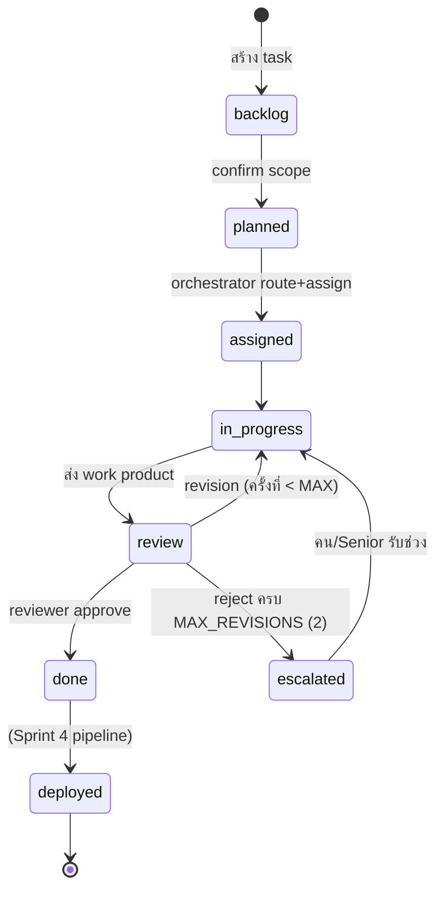

# SYSTEM_DOCUMENTATION.md — DEP-PM Platform

> Source Code / Business Logic / Operations (MASTER PROMPT §5-9, 13-14, 16-22, 24)
> อัปเดต: 2026-07-06 (หลัง Sprint 3) | คู่กับ ARCHITECTURE.md, API.md, DATABASE.md

---

## 5-7. Source Code Analysis (ต่อโมดูล + คลาส/ฟังก์ชันสำคัญ)

### `app/config.py` — Settings
- **Pattern:** Singleton ผ่าน `@lru_cache` บน `get_settings()` — parse `.env` ครั้งเดียวต่อ process
- **Public API:** `Settings` fields (`database_url`, `anthropic_api_key`, `claude_model`, `max_tokens_per_task`, `frontend_origin`) + property `agent_enabled` (key ไม่ว่าง = True)
- **Hidden assumption:** test ที่อยาก override ต้อง set env **ก่อน** import แรก หรือ `get_settings.cache_clear()`
- **Risk:** ต่ำ

### `app/constants.py` — Enums กลาง
- ทุก enum เป็น `str, Enum` → ใช้เทียบกับค่า DB (string) ได้ตรง และ Pydantic validate อัตโนมัติ
- `MAX_REVISIONS = 2` — ค่าคงที่ของ Escalation Rule (แก้ที่นี่ที่เดียว)
- **ทำไมไม่ใช้ DB enum:** ดู DATABASE.md §10

### `app/db/types.py` — หัวใจ ADR-01
- **`GUID(TypeDecorator)`**: PostgreSQL → native `UUID(as_uuid=True)`; อื่น ๆ → `CHAR(36)`
  - `process_bind_param`: normalize ทุก input เป็น UUID แล้ว str (SQLite) — กัน string ปน format
  - `process_result_value`: คืน `uuid.UUID` เสมอ → โค้ดชั้นบนไม่ต้องรู้ dialect
  - `cache_ok = True` จำเป็นสำหรับ SQLAlchemy statement cache
- **Common mistake ที่กันไว้:** เขียน raw UUID string ต่างรูปแบบ (มี/ไม่มี dash) — bind param บังคับ normalize

### `app/db/session.py`
- `check_same_thread=False` เฉพาะ SQLite (FastAPI ใช้ threadpool กับ sync def)
- `get_db()` = FastAPI dependency yield-close — session ต่อ request

### `app/models/*` — ORM 6 ตาราง
รายละเอียดคอลัมน์/ความสัมพันธ์ทั้งหมด → `DATABASE.md` §11
Design pattern: Declarative + `TimestampMixin`; `Task.updated_at` ใช้ `onupdate=utcnow` (Python-side — ทำงานเฉพาะผ่าน ORM ไม่รวม bulk update)

### `app/schemas/*` — Pydantic contracts
- `ProjectCreate` มี model_validator: `type=existing` บังคับ `repo_url`
- `TaskPlan/PlannedTask`: สัญญา JSON ของ PM Agent — `ref` เป็น local id ("T1") ให้ agent อ้าง dependency ก่อนมี UUID จริง
- `ConfirmScopeRequest.task_ids = []` มีความหมายพิเศษ: ยืนยันทั้งหมด (document ใน API.md)

### `app/agents/pm.py` — PM Breakdown
ฟังก์ชันสำคัญ `breakdown_requirement(requirement) -> BreakdownResult`:
```
1. ไม่มี key → fallback plan ทันที (source="fallback")
2. เรียก Claude (system=PM persona, user=requirement)
3. _extract_json: ดึง {...} จากคำตอบ (รองรับ ```json fence / prose ครอบ)
4. json.loads + TaskPlan.model_validate
5. parse fail → ส่งคำตอบเดิมกลับไปให้ model แก้ 1 ครั้ง (_MAX_PARSE_RETRIES=1)
6. ยัง fail / exception เครือข่าย → fallback plan
```
- **ไม่ raise เด็ดขาด** — คุณสมบัติเชิงสัญญา (endpoint พึ่งพา)
- Side effect: ไม่มี (pure ต่อ DB — persistence อยู่ที่ services)
- Complexity: O(1) รอบ API call; regex O(n) ต่อความยาวคำตอบ
- **Edge cases:** requirement ว่าง → fallback title "Untitled task"; คำตอบมีหลาย JSON block → เอา block แรก (fenced ก่อน)

### `app/agents/personas.py`
4 system prompts (PM/DEV/ARCHITECT/REVIEWER) + map `PERSONA_PROMPTS: dict[AgentRole, str]`
REVIEWER สั่งตอบ JSON `{"approved": bool, "comment": str}` เท่านั้น — สัญญากับ `runtime.review()`

### `app/agents/routing.py`
`route_task(db, task) -> AgentRole`:
- Keyword heuristic (ไทย+อังกฤษ 10 คำ) ใน title+description+spec → SENIOR_ARCHITECT, ไม่เจอ → DEV
- **ทุกการตัดสินใจ log audit `task.routed`** พร้อม matched_keyword (Risk #5 — เก็บข้อมูลไว้ปรับ rules)
- ทางเลือกที่ไม่เลือก: LLM-based routing (แพง+ช้าเกินเหตุสำหรับ decision ตื้น; ทบทวนเมื่อมีข้อมูล audit จริง)

### `app/agents/runtime.py` — Executor abstraction
- **`PersonaExecutor` (Protocol):** `execute(task, role, feedback) -> str` และ `review(task, work) -> ReviewResult` — orchestrator เห็นแค่นี้ (จุดเสียบ Team Mode)
- **`FallbackExecutor`:** deterministic — execute คืนข้อความ `(fallback:role) …`, review approve เสมอ → happy path E2E รันได้โดยไม่มี network
- **`ClaudeExecutor`:** key เดียวทุก persona (Solo Mode); review parse JSON ผ่าน `_extract_json` เดิม
  - **การตัดสินใจสำคัญ:** review parse ไม่ได้ → **auto-approve** พร้อม comment `(unparseable review — auto-approved)` — เลือกฝั่งนี้เพราะฝั่งตรงข้าม (treat เป็น reject) จะ escalate ทุก task เมื่อ model ตอบเพี้ยน ซึ่งแย่กว่า | **ความเสี่ยงที่ยอมรับ:** งานคุณภาพต่ำอาจหลุด review เมื่อ output เพี้ยน → ทบทวนเมื่อใช้ key จริง (บันทึกใน §22)
- `get_executor()`: factory ตาม `settings.agent_enabled`

### `app/orchestrator/state_machine.py` — ดู §9 (Business Logic)

### `app/orchestrator/engine.py` — Solo Mode loop
ฟังก์ชันสำคัญ:
- `_deps_met(db, task)`: ทุก id ใน depends_on ต้อง**มีอยู่จริงและ** done/deployed — id หาย = ถือว่า dep ไม่ครบ (ปลอดภัยฝั่ง fail-closed)
- `_next_runnable`: planned tasks เรียง created_at → ตัวแรกที่ deps ครบ | O(P×D) ต่อรอบ — พอสำหรับโปรเจกต์ระดับร้อย task
- `_run_task`: ดู flow ใน §9 | commit ไม่อยู่ในนี้ (caller จัดการ)
- `run_project(db, project_id, executor=None, max_tasks=None)`: วนจน `_next_runnable` คืน None; **commit ต่อ task**; executor param = จุด inject mock ใน tests
- **Thread safety:** ไม่ thread-safe (ออกแบบให้รันทีละ request) — ห้ามยิง `/run` ซ้อนโปรเจกต์เดียวกัน (บันทึกเป็น known limitation §22)

### `app/bus/dispatcher.py`
- `publish(db, …) -> AgentMessage`: persist เสมอ (flush ไม่ commit) → fan-out ไป subscribers ใน process
- `subscribe/clear_subscribers`: module-level list — MVP ยังไม่มี subscriber ถาวร (tests ใช้)
- **Upgrade path:** เปลี่ยน transport เป็น Redis Streams โดย signature `publish` คงเดิม (ADR-03)

### `app/services/`
- `audit.record_audit(...)`: add-not-commit (convention เดียวกับ transition/publish)
- `tasks.persist_task_plan(db, project_id, plan)`: **two-pass ref resolution** —
  pass 1 สร้างทุกแถว + flush (ได้ UUID), pass 2 แปลง depends_on ref→UUID; **ref ที่ resolve ไม่ได้ถูก drop เงียบ** (LLM อาจอ้าง ref มั่ว — เลือก tolerate มากกว่า reject ทั้ง plan)

### `app/api/*` — Routers
บาง ๆ ตาม convention: แปลง HTTP ↔ ORM/service, จับ `InvalidTransition` → 409
จุดที่ควรรู้: `list_tasks` นับ total แบบโหลดทุกแถว (ดู §16), `PATCH` แยก status (ผ่าน transition) ออกจาก field อื่น (audit `task.updated`)

---

## 8. Algorithm Analysis

ระบบนี้ algorithm หนักอยู่ 3 จุด (ที่เหลือเป็น CRUD):

### A) Two-pass dependency resolution (`persist_task_plan`)
- **ทำไม:** LLM อ้าง dependency ด้วย ref ("T2 รอ T1") ก่อน UUID จะเกิด — ต้องสร้างก่อนแล้วค่อย map
- Pseudo: `pass1: insert all, flush, ref→id map` → `pass2: depends_on = [map[r] for r in refs if r in map]`
- Complexity: O(N + E) | ทางเลือกที่ไม่เลือก: topological sort ตอน insert (ไม่จำเป็น — ลำดับ insert ไม่มีผล เพราะ resolve หลัง flush)

### B) Runnable-task scheduling (`_next_runnable` + `_deps_met`)
- เลือก planned task ตัวแรก (FIFO ตาม created_at) ที่ dependency จบแล้ว — ได้ dependency ordering โดยไม่ต้อง topo-sort เต็มรูปแบบ
- Deadlock-free: ถ้า dep escalate → dependent ค้าง planned ตลอด → loop จบเอง (คืน None) — **ไม่ infinite loop**
- Complexity ต่อ project run: O(T² × D) worst case (เรียก _next_runnable ใหม่ทุก task) — ยอมรับได้ที่ T≤หลักร้อย; ถ้าเกิน ค่อยทำ in-memory dependency graph

### C) Review-revision loop with escalation (ดู §9 State Machine)

---

## 9. Business Logic

### Task State Machine (source of truth: `orchestrator/state_machine.py`)



**กติกาบังคับ (invariants):**
1. ทุก status change ผ่าน `transition()` เท่านั้น → validate + audit อัตโนมัติ | ฝ่าฝืน = bug
2. ผิด transition → `InvalidTransition` → API 409 | `deployed` เป็น terminal
3. `transition()` ไม่ commit — caller เป็นเจ้าของ transaction

### Escalation Rule — การตีความ "Max Revision = 2"
Blueprint เขียน "Review --fail 2 ครั้ง--> Escalated" → implement เป็น:
```
reject → revision_count += 1
  ├─ revision_count < 2  → กลับ in_progress พร้อม feedback (แก้ได้ 1 รอบจริง)
  └─ revision_count == 2 → escalated + broadcast question ถึงผู้ใช้
```
(ตัดสินใจบันทึกใน PROJECT_STATUS Sprint 2 — ตีความตามตัวอักษร "fail 2 ครั้ง")

### Decision Tree — Breakdown source
```
มี ANTHROPIC_API_KEY?
├─ ไม่ → fallback (1 task)                      → source: "fallback"
└─ ใช่ → เรียก Claude → parse ได้?
        ├─ ใช่ → TaskPlan                        → source: "agent"
        └─ ไม่ → retry 1 → parse ได้? → agent
                          └─ ไม่ → fallback
```

### Workflow: New Project Onboarding (Blueprint §6 STEP 1-4)
UI `/projects/new` → `POST /projects` → `POST /breakdown` (เห็น plan) → ผู้ใช้ตรวจ → `POST /confirm` → บอร์ด
Existing: แทน breakdown ด้วย `POST /scan` (mock — ADR-02)

### Failure scenarios & recovery
| Failure | พฤติกรรม | Recovery |
|---------|----------|----------|
| Claude API ล่ม/timeout ระหว่าง breakdown | fallback plan, ไม่ 500 | ผู้ใช้ลบ task แล้ว breakdown ใหม่ได้ |
| Reviewer output เพี้ยน | auto-approve + note | ตรวจ audit/message log ย้อนหลัง |
| Task escalated | หยุดที่ escalated + broadcast question | คนแก้แล้ว PATCH → in_progress (state machine อนุญาต) |
| Orchestrator crash กลาง run | task ที่ commit แล้วคงอยู่; task ที่ค้าง in_progress ต้อง PATCH มือ | rerun `/run` ทำต่อเฉพาะ planned ที่เหลือ |

---

## 13. Frontend Documentation

- **Routing (App Router):** `/` Portfolio · `/projects/new` Onboarding · `/projects/[id]` Kanban — ทุกหน้าเป็น **client component** (data มาจาก polling ฝั่ง browser; ไม่ใช้ server fetch เพราะข้อมูล refresh ตลอด)
- **State management:** ไม่มี global store — state อยู่ใน `usePolling` ต่อหน้า + local useState | เหตุผล: ไม่มี state ข้ามหน้า, Redux/Zustand เกินจำเป็น
- **`usePolling(fetcher, 4000)`:** interval refetch, ข้ามเมื่อ `document.visibilityState !== "visible"`, เก็บ fetcher ใน ref กัน stale closure | คืน `{data, error, refresh}` — `refresh` ใช้หลัง mutation เพื่อไม่รอรอบ
- **Component ใน `[id]/page.tsx`:** `BoardPage` (จัดการ run/move) → `TaskCard` (transition buttons จาก `ALLOWED_TRANSITIONS`) → `TaskDetail` (side panel + polling messages 5s) → `MessageBubble`
- **Next 16 gotcha:** dynamic `params` เป็น `Promise` — unwrap ด้วย `React.use()` (ดู `frontend/AGENTS.md`)
- **Optimization ปัจจุบัน:** ไม่มี memo/virtualization — บอร์ดระดับร้อย task ยังไหว; พันตัวค่อย virtualize

## 14. Backend Documentation (สรุปเชิงชั้น)
Router (HTTP เท่านั้น) → Services/Orchestrator (business logic + transaction owner) → Models (ORM) → db/ (infra)
- **DI:** FastAPI `Depends(get_db)` — tests override ด้วย in-memory session
- **Error handling หลัก:** `InvalidTransition` → 409; Pydantic → 422; ที่เหลือ FastAPI default
- **Caching:** ไม่มี (ข้อมูลเปลี่ยนตลอด + single-user)

---

## 16. Performance
- **Critical path จริง = LLM latency** (วินาที/call) ไม่ใช่ DB (ms) — `/run` แบบ synchronous จึงเป็นคอขวดแรกเมื่อ task เยอะ
- จุดที่รู้ว่า suboptimal (ยอมรับใน MVP): `list_tasks` total นับแบบโหลดหมด → COUNT(*); `_next_runnable` re-query ต่อ task; portfolio โหลด deployments ทุกแถว → window function เมื่อย้าย PG
- Benchmark แนะนำเมื่อถึง Sprint 4: seed 500 tasks → วัด p95 ของ `GET /tasks` และเวลารวม `/run` (mock executor)

## 17. Error Handling
- **หลักการ:** เส้นทาง agent **degrade ไม่ crash** (fallback ทุกชั้น: no-key, network error, parse fail)
- Exception ที่นิยามเอง: `InvalidTransition` ตัวเดียว — เจตนา (domain error อื่นยังไม่มีเคสจริง)
- Retry: PM breakdown retry 1 (โครงสร้าง JSON); anthropic SDK มี HTTP retry ในตัว
- ยังไม่มี: structured logging, error tracking (Sentry ฯลฯ) — หลัง MVP

## 18. Testing (34 เคส — `backend/tests/`)
| ไฟล์ | ครอบคลุม |
|------|----------|
| conftest.py | in-memory SQLite ต่อ test (StaticPool) + TestClient override `get_db` |
| test_projects.py | CRUD + validation (existing ต้องมี repo) |
| test_breakdown.py | JSON extraction, fallback, endpoint, confirm, **ref→UUID resolution** |
| test_scan.py | mock scan → 3 backlog tasks; reject type=new |
| test_tasks.py | PATCH + messages |
| test_state_machine.py | **transition matrix ทุกคู่ (64)** , audit, 409 ผ่าน API, เดินครบ lifecycle |
| test_orchestrator.py | E2E happy path (API), audit ครบ 4 transitions, revision→done, **escalation ที่ MAX_REVISIONS**, dependency ordering, dependent ของ escalated ค้าง planned |
| test_routing_bus.py | routing keywords, publish persist+dispatch, endpoint 201/404 |

- **Mocking strategy:** ไม่ mock HTTP — inject `RejectingReviewer` ผ่าน `executor` param (ทดสอบ logic จริง ไม่ผูก anthropic SDK)
- **ช่องว่างที่รู้:** ClaudeExecutor ไม่ถูก integration-test (ไม่มี key); frontend ไม่มี unit test (verify ด้วย build + E2E มือ) — ดู §22

## 19. Deployment (ปัจจุบัน + แผน)
**ปัจจุบัน (dev):** ตามคำสั่งใน CLAUDE.md §Development Commands (alembic → uvicorn / npm run dev)
**Env vars:** backend `.env` = DATABASE_URL, ANTHROPIC_API_KEY, CLAUDE_MODEL, MAX_TOKENS_PER_TASK, FRONTEND_ORIGIN | frontend `.env.local` = NEXT_PUBLIC_API_URL
**Sprint 4 (แผนตาม DEVELOPMENT_PLAN):** GitHub Actions → Vercel (FE) + Render/Railway (BE), PostgreSQL, `repository_dispatch` pipeline, staging auto + production manual gate | Rollback: redeploy commit เดิม + `alembic downgrade`

## 20. Monitoring (ยังน้อย — ตามสถานะ MVP)
มีแล้ว: `GET /health` (+ `agent_enabled`), uvicorn access log, audit_log/agent_messages ใน DB
ยังไม่มี (แผนหลัง Sprint 4): structured logs, metrics (token usage ต่อ task!), tracing, alerting

## 21. Maintenance Guide
- **Conventions:** ตาม CLAUDE.md (Code Editing Rules + Project-specific rules) — สรุปเชิงปฏิบัติใน AI_AGENT_GUIDE.md
- **Branch strategy:** ปัจจุบัน commit ตรง master, 1 commit/sprint | เมื่อมี collaborator: feature branch + PR
- **Versioning:** ยังไม่ tag — เริ่ม v0.x เมื่อ deploy จริง Sprint 4
- **Dependency updates:** pin exact version ใน requirements.txt; อัปเดตพร้อมรัน test suite เต็ม
- **ขั้นตอนเพิ่ม status ใหม่ (ตัวอย่าง maintenance ที่พบบ่อย):** เพิ่มใน `constants.TaskStatus` → `ALLOWED_TRANSITIONS` (backend) → `frontend/src/lib/types.ts` (ทั้ง type + ALLOWED_TRANSITIONS + STATUS_ORDER + สี) → เพิ่มเคสใน test_state_machine → อัปเดต docs

## 22. Future Improvements / Technical Debt (จัดอันดับ)
| # | รายการ | ผลกระทบ | แผน |
|---|--------|---------|-----|
| 1 | `/run` synchronous + ไม่ thread-safe ต่อโปรเจกต์ | UX ค้าง, ห้ามรันซ้อน | background worker + task queue (Sprint 4/หลัง) |
| 2 | ClaudeExecutor ไม่เคยรันกับ API จริง | ความเสี่ยง integration ซ่อนอยู่ | ทดสอบทันทีที่ได้ key |
| 3 | Reviewer parse-fail = auto-approve | งานคุณภาพต่ำอาจหลุด | เปลี่ยนเป็น structured output / retry เมื่อใช้ key จริง |
| 4 | types.ts sync มือ | contract drift เงียบ | พิจารณา openapi-typescript codegen |
| 5 | `depends_on` ไม่มี referential integrity | dangling id ถ้าลบ task | เช็คตอนลบ task หรือยอมรับ (fail-closed อยู่แล้ว) |
| 6 | นับ total แบบโหลดหมด ฯลฯ (ดู §16) | ช้าเมื่อ data โต | แก้ตอนย้าย PG |
| 7 | ไม่มี token-usage tracking ต่อ task | คุมงบไม่ได้ (Risk #3) | เพิ่มก่อนเปิด Team Mode |

---

## 24. Glossary
| คำ | ความหมายในระบบนี้ |
|----|--------------------|
| **Persona** | บทบาทของ Claude ผ่าน system prompt (PM/Dev/Architect/Reviewer) — Solo Mode ใช้ key เดียวทุก persona |
| **Solo / Team Mode** | Solo = Claude ทุกบทบาท; Team = map role→provider ต่างกัน (Sprint 4) |
| **Task Plan** | JSON ที่ PM Agent คืน (`TaskPlan` schema) — ref เป็น local id ก่อน resolve เป็น UUID |
| **Breakdown** | การแตก requirement → Task Plan |
| **Confirm scope** | ผู้ใช้ยืนยัน backlog → planned (STEP 4 ของ onboarding) |
| **Transition** | การเปลี่ยน status ผ่าน state machine (ทางเดียวที่ถูกต้อง) |
| **Revision** | reviewer ปฏิเสธ → งานกลับไปแก้ (นับใน revision_count) |
| **Escalation** | reject ครบ MAX_REVISIONS → หยุดรอคน (status escalated + broadcast question) |
| **Message Bus** | `bus.publish` — persist ลง agent_messages เสมอ + in-process fan-out (ADR-03) |
| **Handoff / Result / Review comment / Question** | ประเภทข้อความบน bus (question = broadcast เช่น escalation) |
| **Baseline Report** | ผล scan โปรเจกต์ existing — mock จาก StubMetadataProvider ตลอด MVP (ADR-02) |
| **Fallback** | เส้นทาง deterministic เมื่อไม่มี API key / LLM ล้มเหลว |
| **ADR** | Architecture Decision Record — ADR-01..04 ใน DEVELOPMENT_PLAN.md §2 |
